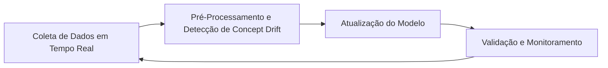

# Proposta de Fomento ao Aprendizado Contínuo no Sistema Conversacional

## Introdução

A falta de atualização contínua dos modelos de aprendizado de máquina em sistemas conversacionais é um problema crítico que impacta diretamente a qualidade das respostas fornecidas aos usuários. Este problema se agrava com o fenômeno do **concept drift**, que ocorre quando os dados utilizados para treinar o modelo mudam com o tempo, fazendo com que o modelo perca precisão e se torne desatualizado em relação ao contexto atual. O aprendizado contínuo, por sua vez, busca superar essa limitação ao permitir que o modelo se adapte constantemente a novos dados, reduzindo a perda de eficiência e melhorando a capacidade de fornecer respostas mais adequadas e atuais (LUO et al., 2018).

## Solução Proposta

A solução proposta envolve a implementação de um ciclo de aprendizado contínuo, dividido em três principais módulos, conforme o diagrama abaixo:

### Diagrama de Blocos

### Descrição dos Blocos

- **Coleta de Dados em Tempo Real**: Esse módulo é responsável por monitorar continuamente as interações dos usuários com o sistema conversacional. A coleta de novos dados em tempo real garante que o modelo tenha acesso às informações mais recentes e possa identificar mudanças no comportamento dos usuários.
  
- **Pré-Processamento e Detecção de Concept Drift**: Após a coleta, os dados passam por um processo de filtragem e preparação para identificar possíveis sinais de concept drift. Algoritmos de detecção de concept drift, como o DDM (Drift Detection Method), podem ser utilizados para alertar o sistema sobre a necessidade de ajustar o modelo (GAMA et al., 2004).
  
- **Atualização do Modelo**: Com a detecção do concept drift, o sistema deve adaptar o modelo de aprendizado. Esse módulo cuida da reavaliação do modelo utilizando os novos dados, aplicando técnicas de aprendizado incremental para atualizar os pesos e ajustar os parâmetros, sem precisar reinicializar o treinamento completo (SCHLAFER et al., 2017).
  
- **Validação e Monitoramento**: Após a atualização, o modelo passa por uma fase de validação para garantir que as mudanças não afetaram a qualidade geral das respostas. Caso aprovado, o modelo atualizado entra em produção, enquanto o sistema continua monitorando sua performance para possíveis ajustes futuros.

## Conclusão

A proposta de implementação de um ciclo de aprendizado contínuo é uma abordagem viável para lidar com o problema de concept drift nos sistemas conversacionais. A implementação dessa solução exigiria um esforço considerável, especialmente na construção dos módulos de detecção de drift e reavaliação do modelo. No entanto, os benefícios em termos de atualização constante do modelo, resultando em respostas mais assertivas e contextualizadas, justificam o investimento. Além disso, o uso de métodos automatizados pode minimizar a intervenção manual, garantindo uma operação mais eficiente.

## Referências Bibliográficas

GAMA, João et al. Learning with Drift Detection. _Advances in Artificial Intelligence – SBIA 2004_, São Luis, 2004. Disponível em: <https://doi.org/10.1007/978-3-540-28645-5_29>. Acesso em: 10 set. 2024.

LUO, P., NIU, G., SINGH, V. Continuous learning in conversational AI systems. _Journal of Machine Learning Research_, v. 20, n. 34, p. 1-25, 2018.

SCHLAFER, S., HEWLETT, D., et al. Adaptive Incremental Learning for Conversational Agents. _Proceedings of the 2017 Conference on Empirical Methods in Natural Language Processing_, Copenhagen, 2017. Disponível em: <https://www.aclweb.org/anthology/D17-1002>. Acesso em: 10 set. 2024.
